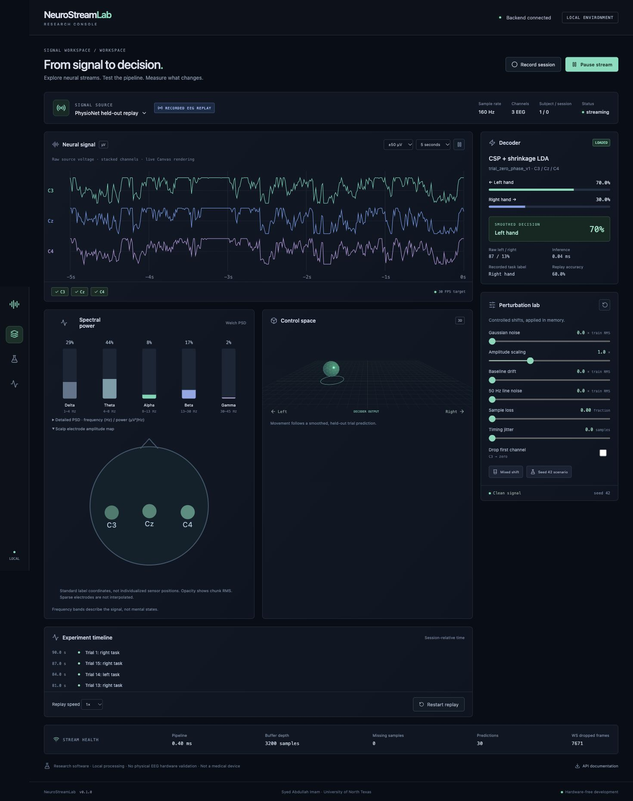
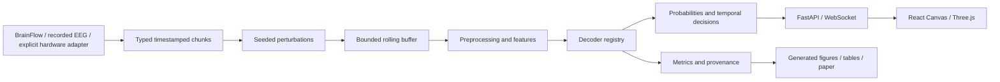

# NeuroStreamLab

**A local, hardware-free research console for EEG replay and decoder robustness.**

Develop the BCI software pipeline before buying EEG hardware: acquire timestamped chunks, process signals, replay held-out human EEG, inject reproducible shifts, decode trials, and explore decisions in an interactive browser application.



Synthetic data exercises acquisition and transport. Recorded replay demonstrates trained decoding of **previously collected** human motor imagery. The UI explicitly labels the source and simulated control. This is research software, not a medical device, and has no physical hardware validation.

## Quick start

Requires Python **3.12**, Node **22 or 24**, macOS arm64 or Linux. The default demo needs no EEG device, dataset download, GPU, account or paid service.

```bash
./scripts/bootstrap.sh
./scripts/demo.sh
```

Open **http://127.0.0.1:5173**. Keep the terminal open. Ctrl-C stops both services. The console displays real BrainFlow synthetic-board acquisition, Canvas traces, Welch spectra, standard-label electrode amplitudes, perturbation sliders, a 3D system-test object and runtime telemetry. It does not invent synthetic motor imagery predictions.

```bash
make replay-demo
```

The replay command downloads the configured public subset if absent, trains CPU models, creates a held-out PhysioNet replay artifact, and launches the same console. True recorded task labels, raw probabilities, smoothed decisions and trial-session accuracy are shown separately. The object follows the trained decoder. Replay is paced incrementally and supports pause, resume, loop, seek and speed changes. Concatenated task epochs omit original inter-trial rest periods.

## Research workflow

Use `.venv/bin/neurostreamlab` or activate the virtual environment first.

```bash
source .venv/bin/activate
neurostreamlab doctor
neurostreamlab dataset list
neurostreamlab dataset info PhysionetMI
neurostreamlab dataset fetch PhysionetMI --subject 1
neurostreamlab model train --dataset PhysionetMI --decoder csp_lda --output models/custom
neurostreamlab model evaluate models/custom
neurostreamlab benchmark run configs/benchmarks/smoke.yaml
neurostreamlab benchmark run configs/benchmarks/paper_v1.yaml
neurostreamlab benchmark aggregate
neurostreamlab figures generate
make reproduce-paper
make audit
```

Smoke is a subject-1 compatibility run. Standard and paper use an explicitly small laptop cohort, not an exhaustive competitive benchmark. The frozen paper design includes PhysioNet subjects 1-5 (imagined left/right hand runs), BNCI2014_001 subjects 1-3 (cross-session), C3/Cz/C4, and bandpower logistic regression, CSP/shrinkage LDA and Braindecode EEGNet. All three execute on CPU. Epochs are [0.5,3.5) seconds with trial-local mean removal and zero-phase 8-30 Hz filtering. Replay accuracy uses that same trial-end preprocessing. Continuous causal filtering is implemented and tested separately, without transferring the offline accuracy claim.

Nine clean/shift conditions cover multiple Gaussian noise levels, fixed central-channel losses, gain, slow drift and a mixed shift. Expanding RMS alignment is an **unlabeled reference strategy**, with no promise of improvement. Additional line noise, channel noise, timing jitter, sample loss and interruption implementations have deterministic engineering tests. No formal significance or clinical claims are made from the small cohort.

## Architecture



Source contracts, replay, filters, decoders, adaptation, perturbations, evaluation and application code are separate modules. Models use checksum-verified numeric NPZ or safetensors with channel/fs compatibility checks. The producer and bounded WebSocket queues keep browser rendering independent from acquisition. No telemetry, EEG uploads, CUDA or Unity is required.

API: http://127.0.0.1:8000/docs. REST and WebSocket details: [protocol](docs/PROTOCOL.md). Session recording saves local versioned JSONL metadata, events, shifts, predictions and timings without raw EEG by default.

## Paper and measured artifacts

**NeuroStreamLab: Hardware-Free Real-Time BCI Development and EEG Replay Robustness**  
Syed Abdullah Imam, University of North Texas.

- [Compiled manuscript](paper/main.pdf)
- [Reproduction map](paper/README.md)
- [Frozen experiment design](configs/benchmarks/paper_v1.yaml)
- [Subject-level metrics](results/aggregated/subjects.csv)
- [Aggregated results](results/aggregated/metrics.json)
- [Publication provenance manifest](results/manifests/paper_results.json)

`make paper` builds from measured artifacts without downloading EEG. `make arxiv` compiles submission sources independently and creates `paper/neurostreamlab-arxiv.tar.gz`. `make reproduce-paper` reruns all paper experiments and processing profiles, regenerates figures/tables/macros, verifies provenance, compiles and scans the final PDF. No result values are manually entered into tables or numerical figures. Prose uses generated result macros. Neither paper nor software has been externally published by these commands.

## Data, validation and limitations

Datasets are public but have separate terms: [PhysioNet](https://physionet.org/content/eegmmidb/1.0.0/) and [BNCI](https://bnci-horizon-2020.eu/database/data-sets). Downloads, caches, replay data, weights and private session logs are excluded from Git. Data defaults to `data/`, configurable through `NEUROSTREAMLAB_DATA`. See [dataset details](docs/DATASETS.md) and [third-party notices](THIRD_PARTY_NOTICES.md).

`make backend` runs Ruff formatting/lint, mypy and pytest. `make frontend` runs ESLint, strict TypeScript, Vitest and production build. `make audit` includes both plus result verification, manuscript checks and independent arXiv compilation. Tests use deterministic fixtures or the real BrainFlow synthetic board, and CI does not download large EEG datasets.

The main limitations are a small cohort, three electrodes, short deep training, no physical hardware validation, trial-local zero-phase evaluation, abbreviated replay chronology and browser/transport timing not included in latency claims. Read [scientific method](docs/SCIENTIFIC_METHOD.md), [leakage audit](docs/DATA_LEAKAGE_AUDIT.md), [known limitations](docs/KNOWN_LIMITATIONS.md), [reproducibility](docs/REPRODUCIBILITY.md), [hardware extension](docs/REAL_HARDWARE.md) and [design decisions](docs/DECISIONS.md).

MIT software license. Cite using [CITATION.cff](CITATION.cff) and cite datasets independently. Contributions should follow [CONTRIBUTING.md](CONTRIBUTING.md).
