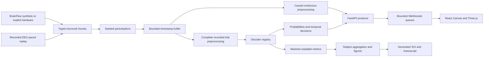

# Architecture

SignalChunk is channel-major, in microvolts, with ordered session-relative timestamps and markers. BrainFlow timestamps are relative to their first acquired board timestamp. RecordedSource delivers bounded chunks paced by a monotonic deadline. Replay source time does not change with playback speed. Loops add a source-time offset, and seek requires buffer and filter reset. The buffer rejects late chunks, detects nominal gaps and retains bounded data with overlap-aware extraction. A missing-sample counter is a timestamp diagnostic, not a guaranteed count of physically lost packets.

The runtime has one acquisition worker per local session, invoked through asyncio.to_thread. An async lock protects runtime control mutations against worker ticks. Browser messages are queued per client with capacity four. Stale display frames are dropped under backpressure and counted, so slow drawing cannot grow backend memory indefinitely. Source updates target 30 Hz, Canvas targets 30 FPS, Welch spectra update once per second, and replay predictions occur at trial boundaries. Raw samples are downsampled by a factor of two for display and limited to eight channels, without changing model input. UI amplitude clipping affects drawing only.

Offline research and replay demonstration use complete-trial mean removal and zero-phase filtering. The stateful causal filter is separately tested for chunk equivalence. Its output is available in the continuous processing path but is not used to claim the offline decoder accuracy. Held-out replay concatenates task epochs, not the full original rest/task recording. Incomplete trials after seek or loss are skipped.

Models are selected through a registry. Directory artifacts contain a checksum-verified NPZ or safetensors file and a JSON manifest describing exact channel order, fs, input window length, class mapping, training IDs, preprocessing and software. Loading never executes pickle payloads. Runtime model compatibility errors are explicit.

The console's 3D object follows the temporal decision on recorded EEG. In synthetic mode its input is a deterministic sine control for system testing, clearly labeled. There is no meaningful motor imagery prediction in synthetic mode.

The server exposes OpenAPI at /docs. Services bind to loopback. All downloads and session exports are local. See PROTOCOL.md for message and recording formats.
